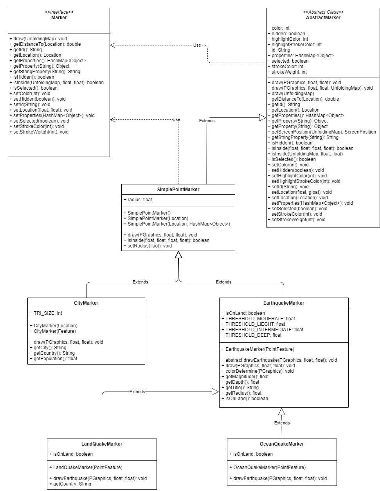

# EarthquakesMapJava

This is a project developed during the UCSD Coursera MOOC Object Oriented Programming in Java: https://www.coursera.org/learn/object-oriented-java.  

It uses Processing and UnfoldingMap Java libraries to create an interactive map that displays information about the most recent erthquakes globally.

<h3>Class Diagram</h3>

